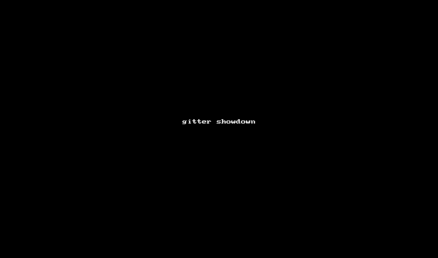

Better command line interface for Git
=====================================

I love git and I love the command line, but sometimes the git command line
interface feels a bit tedious. Gitter addds non-intrusive interactive menus
to the common git commands, but otherwise stays out of your way.

Gitter uses [termenu](https://github.com/elifiner/termenu) for the menus.

Usage
=====

After you install gitter, I highly recommend creating an alias:

    $ alias gt=gitter

Gitter works exactly like git and accepts all its commands and parameters. 

When you don't supply arguments for common commands, an appropriate menu is shown.
Note that you can search in the menu just by typing stuff and use `<space>` to select multiple items.

Here are the supported commands:

* `gt checkout` - shows a list of mofidied files, local branches and remote branches
* `gt add` - shows a list of modified and untracked files
* `gt rm` - shows a list of files to delete
* `gt reset` - shows a list of add'ed files to reset
* `gt cherry-pick` - shows a list of branches to choose from and then a list of commits from that branch
* `gt merge` - shows a list of branches
* `gt show` - shows a list of commits in the current branch
* `gt clean` - shows a list of untracked files
* `gt branch -d` - shows a list of branches for deletion
* `gt revert` - shows a list of commits to revert
* `gt rebase -i` - select a commit to interactively rebase from

Installation
============

The package is available from PyPI, so installation is easy:

    sudo pip install gitter
